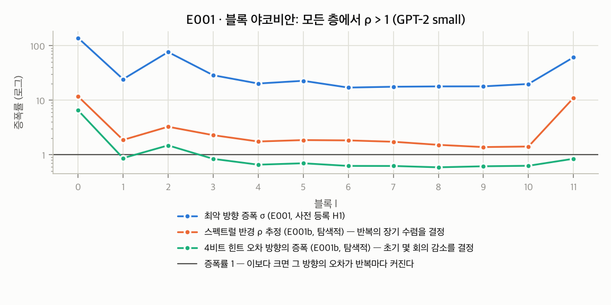
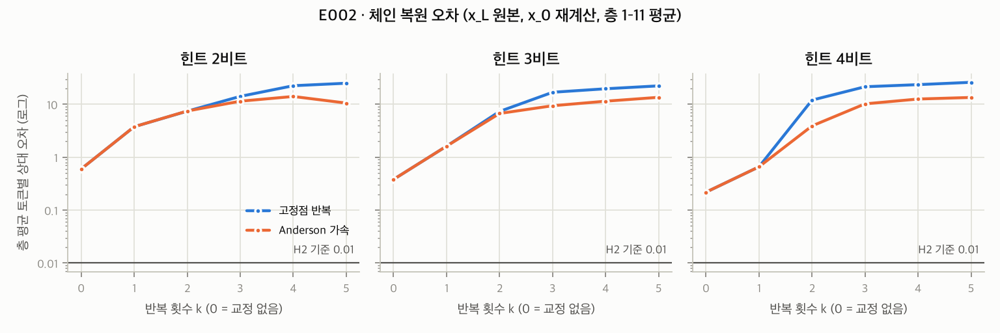
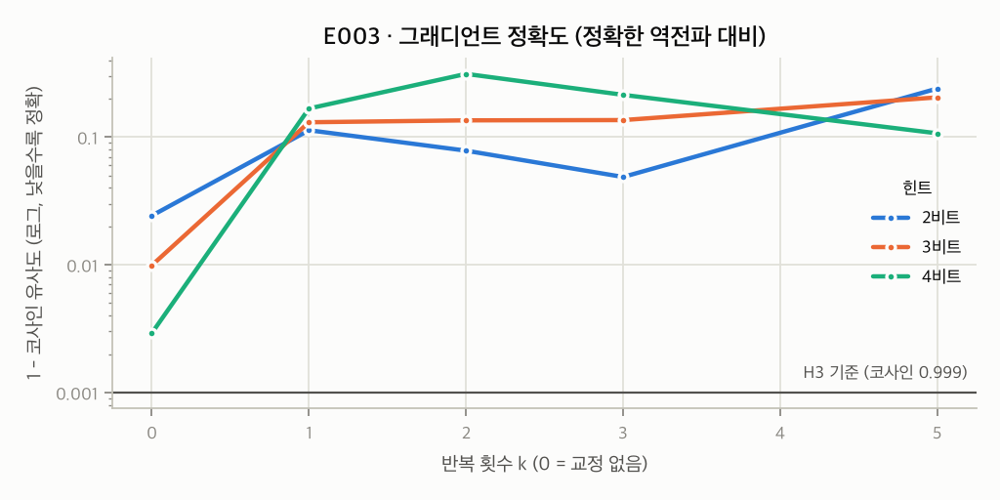

# 0018. α 검증 E001~E003 결과: 가설 H1·H2·H3 모두 기각, 관문 Gα 중간 판정 = 기각

- **날짜**: 2026-09-25
- **유형**: experiment
- **상태**: 확정 — **α(잔차 고정점 체크포인팅)는 현재 형태로 기각** (0017의 사전 등록 규칙) / 선행 이론(Kim 2021: 셀프 어텐션 비-Lipschitz) 누락 확인, 주장 범위 재검토 제안(→ 0029 C1)
- **관련 기록**: 0006 (α 제안), 0017 (사전 등록), 0015 (P1 실험 우선)
- **원시 데이터**: `docs/research/data/e001/`, `e002/`, `e003/` (results.json, env.json, 그림)

## 요약

| 가설 | 사전 등록 기준 | 결과 | 판정 |
|---|---|---|---|
| H1 블록이 수축적이다 | σ_l < 1인 블록 ≥ 9/12 | σ_l = **17 ~ 139**, 0/12 | ❌ |
| H2 복원이 수렴한다 | b=4, k=3에서 층 평균 오차 ≤ 0.01 그리고 k=0 대비 ≤ 0.5배 | Anderson **10.2** (k=0: 0.218, **47배 악화**) | ❌ |
| H3 그래디언트가 정확하다 | b=4, k=3에서 코사인 ≥ 0.999 | **0.786** (k=0: 0.9971) | ❌ |

사전 등록 규칙 "k=5에서도 H2·H3 실패 → α 기각 또는 수정안 기록"에 해당한다.
**교정 반복(k ≥ 1)은 모든 비트 폭에서 교정하지 않은 경우(k=0)보다 나빴다.**

## 구현 타당성 (실험 유효 조건)

| 검사 | 결과 |
|---|---|
| 블록 순차 호출 대 전체 모델 (은닉 상태·로짓) | 상대 오차 **0.0** (완전 일치). 마지막 은닉 상태는 ln_f 이후 값으로 일치 |
| 수동 블록 역전파(정확한 입력) 대 autograd | 코사인 **1.0000000**, 상대 오차 0.0, 손실 3.63170266 대 3.63170290 |
| E001 야코비안 곱의 정확성 | 이중 역전파 Jv 대 float64 유한 차분: 상대 차이 **2.1e−6**, 최상위 특이 방향 증폭 22.730 대 22.730 (블록 5) |
| transformers 5.17 주의점 | 블록을 직접 호출하면 인과 마스크가 적용되지 않는다. 가산형 마스크를 직접 전달해 해결 |

## E001 — 야코비안 노름 (사전 등록) + E001b (탐색적, 사전 등록 아님)

| 블록 | σ (최악 방향) | ρ 추정 (스펙트럴 반경) | 무작위 방향 증폭 | 4비트 힌트 오차 방향 증폭 | 2비트 힌트 오차 방향 증폭 |
|---|---|---|---|---|---|
| 0 | 139.2 | 11.77 | 5.73 | 6.53 | 11.28 |
| 1 | 24.3 | 1.87 | 0.81 | 0.87 | 1.05 |
| 2 | 76.6 | 3.27 | 1.29 | 1.49 | 1.50 |
| 3 | 28.8 | 2.29 | 0.84 | 0.84 | 1.15 |
| 4 | 20.2 | 1.75 | 0.67 | 0.66 | 0.81 |
| 5 | 22.7 | 1.86 | 0.69 | 0.70 | 1.15 |
| 6 | 17.1 | 1.83 | 0.65 | 0.62 | 0.80 |
| 7 | 17.7 | 1.73 | 0.64 | 0.62 | 0.83 |
| 8 | 17.9 | 1.52 | 0.61 | 0.59 | 0.73 |
| 9 | 18.0 | 1.38 | 0.62 | 0.62 | 0.78 |
| 10 | 19.9 | 1.42 | 0.64 | 0.63 | 0.87 |
| 11 | 61.2 | 11.02 | 0.81 | 0.85 | 1.66 |

- 블록 5의 최악 방향은 **소수의 토큰**(위치 78, 79, 159, 160)에 몰려 있다(질량 0.68, 0.14, 0.07, 0.06).
- 해석: 1·3~10층에서 오차는 **처음 1~3회는 줄어든다**(보통 방향 증폭 0.59~0.87). 그러나 **모든 층에서 ρ > 1**이라 반복을 계속하면 불안정한 방향의 성분이 커져 결국 발산한다. 0·2·11층은 처음부터 불안정하다.
- α의 핵심 전제("Pre-LN에서는 잔차 스트림 노름이 커지므로 블록이 수축적이다", 0006 H1)는 **틀렸다.**
  잔차 스트림 노름은 실제로 층마다 커지지만(평균 4.7 → 464.7), 수축성을 보장하지 못한다.
  덧붙여 3층부터는 위치 0 토큰의 노름이 약 3,000인 **거대 활성값(massive activation)**이 나타났다.

## E002 — 복원 수렴 (사전 등록)

**체인 복원** (주 시나리오: x_L 원본, x_0 재계산, 층 1~11 평균, 토큰별 상대 오차)

| 비트 | 가속 | k=0 | k=1 | k=2 | k=3 | k=4 | k=5 |
|---|---|---|---|---|---|---|---|
| 2 | plain | 0.598 | 3.76 | 7.41 | 14.1 | 22.4 | 25.0 |
| 2 | Anderson | 0.598 | 3.76 | 7.45 | 11.4 | 14.0 | 10.5 |
| 3 | plain | 0.380 | 1.62 | 7.33 | 16.9 | 19.6 | 22.3 |
| 3 | Anderson | 0.380 | 1.62 | 6.71 | 9.39 | 11.4 | 13.5 |
| 4 | plain | 0.218 | 0.657 | 12.0 | 21.5 | 23.5 | 26.0 |
| 4 | Anderson | 0.218 | 0.657 | 3.90 | **10.2** | 12.6 | 13.5 |
| 8 (참고) | plain | 0.0126 | 0.0373 | 2.72 | 7.52 | 15.9 | 20.5 |
| 8 (참고) | Anderson | 0.0126 | 0.0373 | 0.222 | 0.463 | 0.963 | 6.23 |

- 부 시나리오(x_0도 힌트로 복원, 4비트): k=0 0.214, k=3 plain 61.2, Anderson 40.6. 0층이 가장 불안정하다(ρ ≈ 11.8).

**국소 복원** (진단: 정확한 y를 줌, 층 1~11 평균)

| 비트 | 가속 | k=0 | k=1 | k=2 | k=3 | k=5 | k=10 |
|---|---|---|---|---|---|---|---|
| 4 | plain | 0.218 | 0.154 | 0.183 | 0.544 | 1.11 | 3.13 |
| 4 | Anderson | 0.218 | 0.154 | 0.135 | 0.131 | 0.152 | 0.387 |
| 8 | Anderson | 0.0126 | 0.0097 | 0.0087 | 0.0083 | 0.0105 | 0.0192 |

- 국소적으로는 중간 층(3~10)에서 잠시 수렴한다. 예: 4비트 plain, 9층은 k=5에서 0.050, 10층은 0.056. 그러나 **0·2·11층은 발산**한다.
  11층은 체인에서 **가장 먼저 복원되는 층**이라, 그 발산이 아래 모든 층을 오염시킨다.
- **체인 구조의 결함 (새로 확인됨)**: 방정식 `x = y − f(x)`는 위에서 물려받은 y의 오차를 교정하지 못하고 그대로 전달한다.
  8비트, Anderson, k=1 체인에서 층별 오차가 위(11층) **0.0095**에서 아래(1층) **0.067**로 **선형으로 누적**되었다. 반면 k=0은 전 층 약 0.012로 평탄했다.
- 4비트 힌트 자체의 오차가 약 22%로 큰 것은 거대 활성값·이상치 차원이 64원소 블록의 스케일을 키우기 때문으로 보인다(p95 0.24, 최대 0.26).

## E003 — 그래디언트 정확도 (사전 등록)

| 비트 | k=0 | k=1 | k=2 | k=3 | k=5 |
|---|---|---|---|---|---|
| 2 | 0.9758 | 0.8870 | 0.9218 | 0.9513 | 0.7605 |
| 3 | 0.9901 | 0.8696 | 0.8650 | 0.8644 | 0.7957 |
| 4 | **0.9971** | 0.8330 | 0.6880 | **0.7862** | 0.8932 |

(전체 파라미터 그래디언트 코사인. 가속 방식은 E002에서 선택된 Anderson — 사전 규칙)

- 전체 코사인이 높아도 **LayerNorm 게인 그래디언트는 취약**하다. 4비트 k=0(전체 0.997)에서도 텐서별 최소 코사인은 0.555(`h.1.ln_2.weight`)였다. 2비트 k=0에서는 −0.57까지 내려갔다.
- 참고: **k=0(힌트만 저장)**은 기존 활성값 양자화(ActNN 계열)와 같은 방식이며 memopro의 신규 기법이 아니다.

## 결론

1. **α는 현재 형태로 기각한다.** 세 가설이 모두 기각되었고, 교정 반복은 교정하지 않은 경우보다 나빴다.
2. 실패 원인은 두 가지이며 서로 독립적이다.
   - **(a) 비수축성**: 사전학습 GPT-2의 블록은 모든 층에서 ρ > 1이다. 단순 반복과 Anderson 가속은 결국 발산한다.
   - **(b) 체인 오차 누적**: 역전파 순서의 복원은 위층 오차를 교정 없이 물려받는다. 설령 (a)가 해결되어도 깊이에 비례해 오차가 쌓인다.
3. 0006의 추정치도 정정한다. 계산 비용은 "k=3에서 +50%"가 아니라, 층당 k회의 추가 순전파가 필요하므로 **+75%**(체크포인팅 4F 대비 7F)이다. 효과가 없으므로 의미는 사라졌다.

## 수정안 검토 (기록만, 추진하지 않음)

| 수정안 | 기대 | 판단 |
|---|---|---|
| 구간마다 정확한 체크포인트를 두어 누적 차단 | (b) 완화 | 국소 개선이 최대 2~4배에 그쳐 k=0 힌트보다 나은 점이 거의 없다 |
| Newton–Krylov(GMRES)로 수렴 보장 | (a) 해결 | 반복당 Jv(순전파 약 2~3회분)가 여러 번 필요하다 → 재계산(순전파 1회)보다 비싸서 전제가 무너진다 |
| 문제 토큰만 원본 저장 | (a) 완화 | 탐지 비용이 들고 (b)는 남는다 |
| 수축적이 되도록 파인튜닝(스펙트럴 정규화) | (a) 해결 | "모델 수정 없음"이라는 차별점이 사라지고, i-ResNet·MEFT와 중복된다 |

## 한계

- 한 모델(GPT-2 small, fp32, eval), 한 데이터셋, 배치 4 × 512로 얻은 결과이다. 다른 구조(예: RMSNorm·SwiGLU를 쓰는 LLaMA 계열)에서는 다를 수 있다. 다만 두 번째 원인(체인 누적)은 구조와 무관한 논리적 결함이다.
- ρ 추정은 J에 대한 멱반복의 마지막 10회 평균이다(복소 고윳값이 있으면 근사). 발산은 E002가 직접 확인했다.
- 재현성: 실행 스크립트의 SHA-256은 env.json에 기록되어 있고 현재 파일과 일치함을 확인했다. 다만 공용 모듈 `common.py`의 해시는 이번 실행에서 기록하지 않았다. 이후 하네스는 같은 디렉터리의 모듈과 하네스 자체의 해시도 기록한다.

## 논문 매핑

- **부정적 결과(negative result)**: "사전학습 잔차 블록의 고정점 역산을 통한 활성값 복원은 실패한다 — 비수축성(모든 층 ρ > 1)과 역순 체인의 오차 누적". 워크숍 부정적 결과 트랙이나 센서스 논문의 Discussion 절에 쓸 수 있다.
- **센서스 연구 재료**: 거대 활성값, 4비트 블록 양자화 오차 22%, LayerNorm 게인 그래디언트의 정밀도 민감성.
