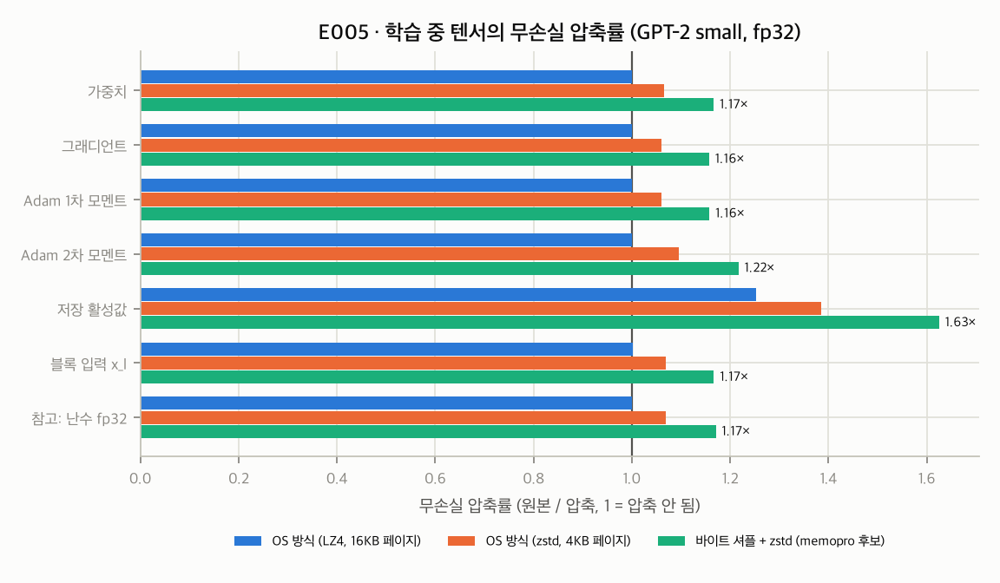

# 0019. E005 결과: 학습 중 텐서의 무손실 중복은 작다 — OS 방식 압축은 fp32에 사실상 무효

- **날짜**: 2026-09-25
- **유형**: experiment
- **상태**: 확정 — 사전 등록된 β 설계 규칙 2 발동 (규칙 1은 미충족)
- **관련 기록**: 0017 (사전 등록), 0015 P3 (OS 기준선), 0013 D10 (census 차별점)
- **원시 데이터**: `docs/research/data/e005/` (results.json, env.json, compression_ratios.png)

## 설정 (0017과 동일)

GPT-2 small, `train()`(dropout 0.1), AdamW(lr 1e−4, wd 0.01), WikiText-2 train, 배치 2 × 256으로 20스텝 학습한 뒤, 21번째 스텝의 텐서를 수집했다.
학습 손실은 4.44에서 3.62로 내려갔다. 수집 텐서: 저장 활성값 271개(float), 정수 3개, 블록 입력 12개. 실행 시간 90초, 최대 RSS 2.82GiB.
범주마다 최대 64MB를 표본으로 삼았다(텐서별로 비례해 연속 구간을 떼어 냄).

## 결과

| 범주 | 전체 크기 | 0차 엔트로피 (비트/원소) | OS 방식 LZ4·16KB 페이지 | OS 방식 zstd·4KB 페이지 | zstd 전체 | **바이트 셔플 + zstd** | bf16 변환 후 셔플+zstd (fp32 대비) |
|---|---|---|---|---|---|---|---|
| 가중치 | 474.7 MiB | 26.76 / 32 | **1.000** | 1.066 | 1.076 | **1.167** | 2.80× |
| 그래디언트 | 474.7 MiB | 27.78 / 32 | 1.000 | 1.060 | 1.067 | 1.157 | 2.75× |
| Adam 1차 모멘트 | 474.7 MiB | 27.48 / 32 | 1.000 | 1.060 | 1.068 | 1.158 | 2.75× |
| Adam 2차 모멘트 | 474.7 MiB | 27.04 / 32 | 1.000 | 1.096 | 1.101 | 1.217 | 3.11× |
| 저장 활성값 | 858.8 MiB | 25.02 / 32 | 1.253 | 1.386 | 1.410 | **1.625** | 3.82× |
| 블록 입력 x_l | 18.0 MiB | 27.02 / 32 | 1.001 | 1.069 | 1.083 | 1.167 | 2.79× |
| 참고: 난수 N(0,1) fp32 | 16.0 MiB | 26.59 / 32 | 1.000 | 1.069 | 1.081 | 1.171 | 2.83× |
| 저장 정수 텐서 | < 0.1 MiB | 11.83 / 64 | 3.53 | 3.82 | 6.53 | 7.95 | — |

- bf16 열은 **손실 변환(수치 변경)**을 포함한 값이다: fp32 → bf16(2배) × bf16 무손실 압축(1.37~1.91배).

## 사전 등록 규칙 판정

| 범주 | 셔플+zstd / OS LZ4 | 규칙 1: ≥ 1.25 (무손실이 OS보다 우위) | 규칙 2: 셔플+zstd < 1.3 (무손실 절감이 작음) |
|---|---|---|---|
| 가중치 | 1.167 | ❌ | ✅ 발동 |
| Adam 1차 | 1.158 | ❌ | ✅ 발동 |
| Adam 2차 | 1.217 | ❌ | ✅ 발동 |

→ **규칙 2 발동**: β의 CPU 가치는 무손실 압축이 아니라 **SSD 방출과 명시적 손실 모드(bf16)**에서 나와야 한다. 큰 유휴 객체의 기본 모드를 재검토한다(0021).

## 해석

1. **학습된 fp32 텐서는 무작위 정규분포만큼만 압축된다.** 가중치 1.167배 대 난수 1.171배이다. 즉 무손실 중복은 지수부 편중에서 오는 약 14%가 거의 전부이고, 모델 특유의 구조는 0차 바이트 통계로 드러나지 않는다.
2. **OS 방식 압축은 fp32 텐서에 사실상 효과가 없다.** 16KB 페이지 단위 LZ4는 1.000배였다. macOS 압축기가 LZ4 계열로 동작한다면, 노트북에 쌓인 유휴 fp32 텐서는 OS 압축으로 거의 줄지 않는다. 남는 OS 수단은 스왑뿐이다.
   - 주의: Darwin 압축기의 또 다른 알고리즘인 WKdm은 재현하지 않았다. 실제 macOS 압축기로 측정하는 것은 후속 과제이다.
3. **예외는 저장 활성값이다(1.63배).** GELU 출력 등 분포가 치우친 텐서가 포함되기 때문으로 보인다. 정밀도를 낮추면(bf16) 3.8배까지 줄어든다.
4. **census 관점**: "무손실 중복도"는 fp32 학습 상태에서 13~22%로 작다. 큰 중복은 **필요 이상의 정밀도(손실 중복)**에 있다.
   - bf16 변환 후 압축으로 2.75~3.8배
   - E003에서 4비트 체크포인트만으로도 그래디언트 코사인 0.997
   - census의 차별점을 보여주려면 빠른 모드(0차 엔트로피)만으로는 약하다. **정밀 모드(필요 비트 측정)**가 핵심이다.

## 한계

- 한 모델, 짧은 학습(20스텝)이다. Adam 상태의 분포는 학습이 길어지면 달라질 수 있다.
- 0차(원소 독립) 엔트로피만 측정했다. 공간 상관을 이용하는 고차 모델에서는 더 줄 수 있다.
- "OS 방식"은 대리 지표이며 실제 커널 압축기가 아니다.
- 압축 처리량은 Python 반복 오버헤드가 포함된 참고치이다.

## 논문 매핑

- **센서스 측정 연구(논문 ②)**: 표 전체. "학습 상태의 무손실 중복은 작고(≈14%), 페이지 단위 범용 압축은 fp32에 무효이며, 절감 여지는 정밀도 쪽에 있다."
- **도구 논문(③)**: β 설계 근거(무손실 대 방출·손실 모드).
