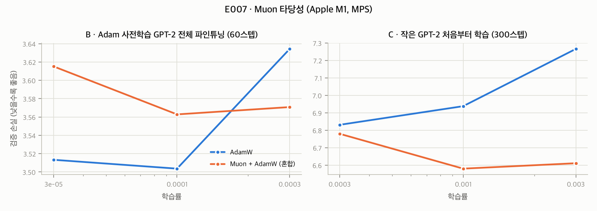

# 0024. E007 결과: Muon 타당성 — 메모리·품질은 통과, Apple Silicon 소배치에서 속도 불합격

- **날짜**: 2026-09-25
- **유형**: experiment
- **상태**: 확정 — 사전 규칙상 **train_session 후보에 추가하지 않음** (M4 불합격). 기록으로 보존
- **관련 기록**: 0023 (사전 등록), 0010 (재구현 금지·충실도 3분류)
- **원시 데이터**: `docs/research/data/e007/` (results.json, env.json, val_loss_vs_lr.png)

## 해석 전제

사용자의 "moun 알고리즘"을 **Muon 옵티마이저**(MomentUm Orthogonalized by Newton–Schulz)로 해석했다. 다른 알고리즘을 뜻했다면 이 기록은 해당하지 않는다.

## 실행 기록

- 첫 실행은 파트 A에서 스크립트 버그(1스텝 실행 시 스텝 시간 평균 계산에서 0으로 나눔)로 **측정값이 나오기 전에** 중단되었다. 해당 줄만 고쳐 재실행했다. 판정 기준·설정은 바꾸지 않았다.
- 장치 MPS(Apple M1), fp32, 총 1,552초. torch 2.14의 내장 `torch.optim.Muon` 사용(재구현 없음).

## 결과

### A. 옵티마이저 상태 메모리 (GPT-2 small, 1스텝 후)

| 구성 | 상태 크기 |
|---|---|
| AdamW 단독 | 949.4 MiB |
| Muon(블록 2D 가중치) + AdamW(나머지) | 625.4 MiB |
| **절감률** | **34.13%** (이론값 34.1%) → **M1 통과** |

### B. Adam 사전학습 GPT-2 small 전체 파인튜닝 (60스텝, 배치 2×256)

| 옵티마이저 | 학습률 3e−5 | 1e−4 | 3e−4 | 스텝 시간 |
|---|---|---|---|---|
| AdamW | 3.5133 | **3.5036** | 3.6343 | **0.89 s** |
| Muon + AdamW | 3.6152 | 3.5629 | 3.5708 | **2.67~2.86 s** |

→ 최적 검증 손실은 AdamW 3.504, Muon 3.563(+1.7%). 문헌(ICML 2026 2605.10468)의 "Adam 사전학습 모델의 Muon 전체 파인튜닝 불일치"와 같은 방향이다(M3b, 기술 통계).

### C. 작은 GPT-2 처음부터 학습 (300스텝, 배치 8×128)

| 옵티마이저 | 학습률 3e−4 | 1e−3 | 3e−3 | 스텝 시간 |
|---|---|---|---|---|
| AdamW | **6.8313** | 6.9381 | 7.2661 | 0.404 s |
| Muon + AdamW | 6.7799 | **6.5803** | 6.6113 | 0.445 s |

→ Muon 최적 6.580이 AdamW 최적 6.831보다 **3.7% 낮다** → **M3a 통과**. 학습률에도 덜 민감했다.

### 판정

| 기준 | 결과 |
|---|---|
| M1 메모리 회계 | ✅ 34.13% (이론 ±2%p 이내) |
| M2 MPS 호환 | ✅ 모든 실행 유한 |
| M3a 처음부터 학습 품질 | ✅ Muon이 3.7% 우수 |
| M3b 사전학습 모델 전체 파인튜닝 | (기술) Muon 1.7% 열세 |
| **M4 속도 ≤ 1.25배** | ❌ **B: 2.98배**, C: 1.10배 |
| **결정** | **후보 추가 안 함** (사전 규칙: M4 실패 → 기록만) |

## 원인 분석 (탐색적, 사전 등록 아님)

1. **Newton–Schulz를 bf16으로 계산**한다(`torch/optim/_muon.py`의 `grad.bfloat16()`). M1은 bf16을 하드웨어로 지원하지 않는다.
   - 768×3072 행렬, 5회 반복: MPS bf16 **50.1ms** 대 fp32 35.1ms (1.43배)
   - CPU bf16 **9,321ms** 대 fp32 70ms (133배) → CPU에서 bf16 Muon은 사실상 불가능하다
2. **구조적 원인: Newton–Schulz 비용은 배치 크기와 무관하다.** 순전파·역전파 비용은 처리 토큰 수에 비례하지만, Newton–Schulz는 행렬 크기에만 비례한다.
   GPT-2 small, 배치 2×256(512토큰)의 대략적 FLOP 추정은 다음과 같다.
   - Newton–Schulz: 행렬 48개 × 5회 반복 → 스텝당 약 1~2 TFLOP
   - 순전파+역전파: 6 × 1.24억 × 512 ≈ 0.38 TFLOP
   → Newton–Schulz가 학습 계산의 **약 3~5배**가 된다. 대형 GPU에서 대배치로 학습할 때 Muon 오버헤드가 작다는 보고는 이 비율이 반대이기 때문이다.
   **메모리가 부족해 작은 배치를 쓰는 사용자일수록 Muon의 상대 오버헤드가 커진다.** memopro의 대상 사용자와 구조적으로 맞지 않는 지점이다.
3. 작은 모델(C)에서는 오버헤드가 1.10배로 작았다. 행렬이 작아 Newton–Schulz 비용이 작기 때문이다.

## 결론: memopro에서 Muon의 위치

| 맥락 | 판단 |
|---|---|
| Apple Silicon, 소배치, 중형 이상 모델 | ❌ 속도 3배 저하 (bf16 미지원 + 소배치 구조) |
| Adam 사전학습 모델의 전체 파인튜닝 | ❌ 품질 열세 (문헌 + 본 실험) |
| LoRA 파인튜닝 | ⚠️ 문헌상 품질 손실 없음. 다만 LoRA 옵티마이저 상태 자체가 작아 **절감 절대량이 작다** |
| 처음부터 학습 (직접 만든 모델), 대배치, CUDA | ✅ 가능성 있음: 옵티마이저 상태 34~43% 절감 + 품질 우위. **CUDA 환경 확인 실험이 필요**하다 |

- memopro 설계 영향:
  - Muon은 **연동 대상**(재구현 금지)이며, 적용되면 충실도 등급은 **의미 변경**(자동 적용 금지, 제안만)이다.
  - 사전 규칙에 따라 현재는 후보가 아니다. 제안 규칙을 만든다면 "처음부터 학습 + 충분한 배치 + bf16 지원 장치"로 한정해야 한다.
  - census가 옵티마이저 상태의 비중을 보여주고 "처음부터 학습하는 경우 Muon 고려 가능"을 정보로 제시하는 정도는 가능하다. 외부 도구가 아니라 PyTorch 내장 기능이므로 S2 기각과도 충돌하지 않는다.
- **G3 관점**: Muon은 메모리를 연산으로 바꾸는 방향(옵티마이저 상태 −34%, Newton–Schulz 연산 +)이다. 그러나 메모리가 부족한 소배치 환경에서는 그 교환 비율이 불리하다.

## 한계

- 한 장치(M1, MPS), 짧은 학습(60·300스텝), 작은 규모. CUDA·bf16 지원 GPU·대배치에서는 결과가 다를 것으로 예상되며, 미검증이다.
- 스텝 시간은 MPS 동기화 기준이다. MPS 드라이버 할당량은 캐싱 때문에 옵티마이저 절감(324MiB)을 반영하지 못했다(두 구성 모두 4,255MiB). 실측 피크 메모리 비교는 후속 과제이다.
- Newton–Schulz FLOP 추정은 대략적 계산이다.

## 논문 매핑

- **도구 논문(③)**: 기존 기법 연동의 판단 사례("메모리 절감 기법의 효율은 배치 크기와 하드웨어에 의존한다").
- **센서스 연구(②) Discussion**: 옵티마이저 상태 비중과 절감 기법의 조건부 효용.
