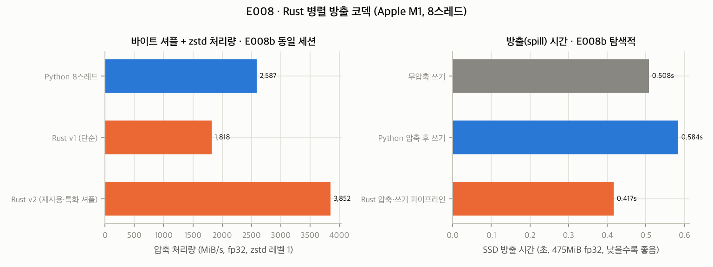

# 0025. E008 결과와 Rust 강점 극대화 전략: "언어가 아니라 설계가 빠르다"

- **날짜**: 2026-09-25
- **유형**: experiment + design + decision
- **상태**: 사전 등록 판정 확정(E008) / 탐색 결과(E008b) 기록 / β 방출 기본값 변경 확정(사전 규칙 C5) / 설계 제안 RS1~RS8 승인 대기
- **관련 기록**: 0023 (사전 등록), 0022 R1 (Rust 역할), 0019·0021 D2 (방출 기본값), 0013 V6 (동면 중 메모리 급증 금지)
- **원시 데이터**: `docs/research/data/e008/` (results.json·env.json = E008, results_v2.json·env_v2.json = E008b, codec_and_spill.png)
- **코드**: `crates/memopro/src/codec.rs`, `crates/memopro-py/src/lib.rs`, `experiments/e008_rust_codec/`

## 전제 정정: Rust의 "메모리 병목이 없다"는 정확히 무엇인가

- Rust에는 **가비지 컬렉터가 없다**. 메모리 해제 시점이 결정적(RAII)이고, 복사 없는 빌림(borrowing)을 컴파일러가 안전하게 보장한다. 데이터 경쟁은 컴파일 시점에 막힌다.
- 그러나 **하드웨어 병목(메모리 용량, 대역폭, 디스크 속도)은 어떤 언어든 똑같다.**
  또한 메모리를 적게 쓰는 것은 자동으로 되지 않는다. E008의 첫 Rust 구현은 메모리 상한 기준(C4)을 **넘겼다**.
- 따라서 Rust의 진짜 장점은 **"메모리를 정확히 통제할 수 있다"**와 **"GIL 없이 안전하게 병렬 파이프라인을 짤 수 있다"**이다. 이 장점은 **설계로 끌어내야** 한다.

## E008 결과 (사전 등록)

| 기준 | 결과 | 판정 |
|---|---|---|
| C1 정확성 | 네 구성 모두 비트 단위 동일, Python과 압축률 동일(상대차 0) | ✅ |
| C2 Rust ≥ 3 × Python 1스레드 | 2.3 / 1.5 / 2.9 / 3.9배 (fp32 L1, fp32 L3, bf16 L1, bf16 L3) | ❌ (1/4만 통과) |
| C3 Rust ≥ 1.3 × Python 병렬 최고 | **0.77 / 0.40 / 0.78 / 0.90배** — Python 스레드보다 **느림** | ❌ |
| C4 메모리 상한 | fp32 증가 **752MB** > 상한 528MB, bf16 355MB > 291MB | ❌ |
| C5 압축 방출이 무압축보다 빠름 | fp32 0.91s 대 **0.77s**, bf16 0.27s 대 **0.16s** | ❌ |

주요 처리량 (MiB/s, 8스레드, 레벨 1, fp32): Python 1스레드 706, **Python 8스레드 2,138**, zstd 내장 MT 436, Rust v1 1,649.
해제(decompress): Rust 병렬 1,428~4,183 대 Python 1스레드 314~460. Python 병렬 해제는 측정하지 않았으므로 비교 결론을 내리지 않는다.

### 원인

- **C3**: 무거운 연산은 numpy 전치와 zstd(C 라이브러리)가 하고, 둘 다 GIL을 푼다. 그래서 **Python 스레드도 진짜 병렬로 돈다.** 여기에 단순한 Rust 구현(청크마다 새로 할당하는 4MB 버퍼와 zstd 문맥, 경계 검사가 있는 셔플)으로는 이길 이유가 없다.
- **C4**: Rust가 만든 압축 결과를 Python `bytes`로 **다시 복사**해 반환했다(출력이 2배로 존재). 입력도 `bytes`만 받으므로, 텐서를 넘기려면 호출자가 `tobytes()`로 **전체를 한 번 더 복사**해야 한다. 이는 0013 V6(동면 중 메모리 급증 금지)에 정면으로 어긋난다.
- **C5**: 이 SSD(F_FULLFSYNC 기준 fp32 쓰기 약 616MiB/s)에서는 fp32를 16% 줄이려고 압축하는 비용이, 줄어든 쓰기 시간보다 컸다.

### 사전 규칙에 따른 결정

- **β 방출 기본값을 무압축으로 변경한다**(C5). 0021 D2의 "압축 방출 기본"을 대체한다. 압축은 선택(명시) 또는 백그라운드 처리로 둔다.
- **"코덱 속도"를 Rust 채택 근거로 쓰지 않는다**(C3).

## E008b 결과 (탐색적, 사전 등록 아님 — 확인 실험 필요)

Rust v2에서 바꾼 것은 세 가지이다.
① 스레드별로 zstd 문맥과 작업 버퍼를 **재사용**
② 2·4바이트 원소에 **특화한 셔플**(경계 검사 제거)
③ 압축과 디스크 쓰기를 **겹치는 파이프라인**. 결과가 Python 객체를 거치지 않고 Rust에서 바로 파일로 간다.

| fp32 (475MiB, 동일 세션) | 결과 |
|---|---|
| Python 8스레드 | 2,587 MiB/s |
| Rust v1 | 1,818 MiB/s |
| **Rust v2** | **3,852 MiB/s (Python 병렬의 1.49배)** |
| 방출: 무압축 쓰기 | 0.508 s |
| 방출: Python 압축 후 쓰기 | 0.584 s |
| **방출: Rust 파이프라인** | **0.417 s (무압축보다 18% 빠름, 쓰기 16% 감소)** |
| Rust 파이프라인 메모리 증가 | 367 MiB (v1 방식 752MB의 약 절반. 다만 설계 목표 약 160MB에는 미달) |

| bf16 (237MiB) | 결과 |
|---|---|
| 처리량 | Python 8스레드 1,936 / Rust v1 1,514 / **Rust v2 2,362** MiB/s |
| 방출 | 무압축 **0.160 s** / Python 0.230 s / Rust 파이프라인 0.181 s (무압축이 여전히 빠름) |
| 메모리 증가 | 98 MiB |

**해석**: 같은 언어(Rust)라도 v1과 v2의 차이는 2.1배이다. **성능을 만든 것은 언어가 아니라 설계**였다.
- 버퍼·문맥 재사용
- 특화 커널
- 연산과 I/O의 중첩
- 경계에서의 복사 제거

Rust가 유리한 점은 이 설계를 **GIL과 데이터 경쟁 걱정 없이, 메모리 해제 시점을 통제하며** 구현할 수 있다는 것이다.
- 남은 과제: fp32 파이프라인의 메모리가 설계 상한을 넘은 원인을 찾아야 한다. 후보는 rayon `map_init`이 스레드가 아니라 작업 단위로 초기화되는 문제, 그리고 할당자의 반환 지연이다.
- 또한 bf16처럼 이미 작은 데이터에서는 압축 방출의 이득이 없다.

## Rust 강점 극대화 전략

### Rust를 쓰지 말아야 할 곳 (증거 기반)

| 영역 | 이유 | 근거 |
|---|---|---|
| GPU 수학 (Newton–Schulz, 행렬곱 등) | torch·Metal·CUDA 커널이 담당한다 | E007 |
| CPU 행렬곱 | torch가 이미 Accelerate(AMX)를 쓴다 (Newton–Schulz fp32 CPU 70ms) | E007b |
| C 라이브러리를 호출만 하는 단순 병렬 | Python 스레드도 GIL을 풀고 병렬로 돈다 | E008 C3 |
| 작은 호출이 잦은 경로 | FFI 경계 비용이 이득을 삼킨다 | 일반 원칙 |

### Rust를 써야 할 곳과 설계 규칙 (제안 RS1~RS8)

| # | 규칙 | 근거 | 적용 대상 |
|---|---|---|---|
| RS1 | **파이프라인 전체를 Rust가 소유**한다. 중간 결과가 Python 객체로 나왔다 들어가지 않게 한다(방출: 텐서 → 셔플·압축 → 파일, 복원: 파일 → 해제 → 텐서 저장공간) | E008 C4 복사 2배, E008b 파이프라인 −18% | β 방출·복원 |
| RS2 | **입력은 복사 없이** 받는다. buffer protocol 또는 DLPack으로 텐서 메모리를 직접 빌린다. `bytes` 입력은 전체 복사(`tobytes`)를 강요하므로 금지 | 0013 V6, E008 C4 | 모든 바인딩 |
| RS3 | **스레드별 상태 재사용**(zstd 문맥, 작업 버퍼) + **상주 스레드 풀**(호출마다 풀을 만들지 않음) | E008b v2 2.1배 | codec |
| RS4 | **메모리 상한을 구조로 보장**한다: 고정 크기 버퍼 풀 + 용량 제한 채널(백프레셔). 상한은 RSS 테스트로 검증 | E008 C4, E008b 미달 | β, 모든 스트리밍 |
| RS5 | **연산과 I/O를 겹친다**(압축 ↔ 쓰기, 읽기 ↔ 해제). 추후 GPU → 호스트 복사도 겹친다 | E008b | β, 방출·복원 |
| RS6 | **특화 커널**: 자주 쓰는 원소 크기(2·4바이트) 경로를 따로 두고, 필요하면 SIMD(NEON/AVX2)를 쓴다 | E008b 셔플 | codec, census 통계 |
| RS7 | **GIL과 무관한 백그라운드 서비스**: 메모리 압박 감시(γ), census 표본 추출을 사용자 Python 코드와 경합 없이 돌린다 | 설계 원칙 | γ, census |
| RS8 | **free-threaded Python 대비**: Rust의 데이터 경쟁 방지 보장을 근거로, 검증 후 `gil_used = false`를 선언한다 | Python 3.14 | 바인딩 |

### 설계에 미치는 영향 (제안)

1. **최소 Python 3.10 → 3.11** (RS2): abi3 조건에서 buffer protocol을 쓰려면 3.11 이상이 필요하다. Python 3.10은 2026년 10월 지원 종료 예정이다. 0015에서 적용한 기본값(3.10)을 되돌리는 제안이다.
2. **Rust 코어 v0.1 범위 = "방출 엔진"** (0022 R1 구체화): 상주 풀, 고정 버퍼 풀, 파이프라인 방출·복원, cgroup 감지, 버퍼 프로토콜 입력.
3. **β 방출 기본값 = 무압축**(확정). 파이프라인 압축은 **확인 실험(E009, 사전 등록 예정)**에서 여러 크기와 여러 날에 걸쳐 무압축보다 빠르다고 확인되면 기본값으로 올린다.

## 한계

- 한 기기(M1 MacBook Air, 8GB, 내장 SSD), 한 종류 데이터(GPT-2 가중치). SSD가 느리거나 압축이 잘 되는 데이터(저장 활성값 1.6배)에서는 결론이 달라질 수 있다.
- E008b는 사전 등록되지 않은 탐색이다. "Rust v2가 1.49배"라는 결과는 확인 실험 전까지 확정이 아니다.
- 복원(디스크에서 읽기)은 OS 페이지 캐시 때문에 측정하지 않았다.

## 논문 매핑

- **도구 논문(③) System 절**: RS1~RS8과 E008/E008b를 "Rust 코어의 역할을 정량화한 설계 결정"으로 기술한다. "언어 교체가 아니라 파이프라인 소유와 복사 제거가 성능을 만든다."
- **Discussion**: 사전 등록 결과(Rust 불리)와 탐색 결과(Rust 유리)를 모두 보고하는 투명성.
